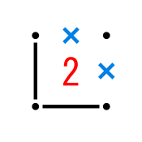
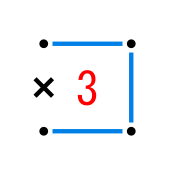
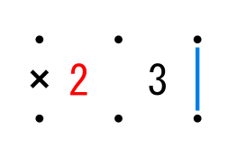

<a href="./index.html">TOPページ</a>

# 付録B　基本解法パターン

#### ノード

|パターン|説明|
|:----:|:---|
||接するエッジのうち2つがONならば、残りのエッジはOFF|
||接するエッジのうち2つがOFFで１つがONならば、残りのエッジはON|
||接するエッジのうち3つがOFFならば、残りのエッジもOFF|
||OFFのエッジを延長したエッジの両側が１と１の場合、延長したエッジはOFF|
||OFFのエッジを延長したエッジの両側が１と３の場合、3のノード側のエッジはON、１の３と逆側のエッジとその隣のエッジはOFF|

#### セル

|パターン|説明|
|:----:|:---|
||セルの数字とONのエッジの数が同じならば、残りのエッジはOFF|
||セルの数字を４から引いた数とOFFのエッジの数が同じならば、残りのエッジはON|
||２のセルのOFFのエッジとは逆側で隣り合ったセルが３ならば、３のセルの２と逆側のエッジがON|

<a href="./index.html">TOPページ</a>

