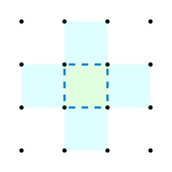

<a href="./index.html">TOPページ</a>

# 付録D　セルの色の解法

#### 調査対象

|パターン|説明|
|:----:|:---|
||あるエッジの状態が確定すると、そのエッジの両側のセルの色が確定しないかのチェックを行う|
||あるセルの色が確定すると、その４周のエッジの状態が確定しないかのチェックを行う|

#### セルの色の確定

|パターン|説明|
|:----:|:---|
||ONのエッジの片側のセルに色がついていると、もう一方のセルは逆の色になる|
||OFFのエッジの片側のセルに色がついていると、もう一方のセルも同じ色になる|

#### セルの色によるエッジの確定

|パターン|説明|
|:----:|:---|
||隣り合ったセルの色が同じなら、間のエッジはOFF|
||隣り合ったセルの色が異なるなら、間のエッジはON|

<a href="./index.html">TOPページ</a>

