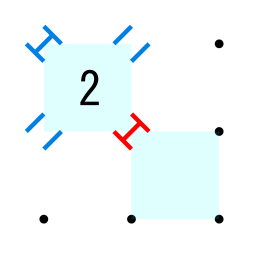

<a href="./index.html">TOPページ</a>

# 付録C　斜めゲート解法

#### 共通事項

##### 調査対象のセル

|パターン|説明|
|:----:|:---|
||あるエッジの状態が確定すると、そのエッジの周囲の６つセル（の４隅のゲート）を対象にゲートのチェックを行う|
||あるセルの一つのゲートの状態が確定すると、そのゲートの向こう側のセル（の４隅のゲート）もゲートチェックの対象の加える|

##### ゲートの状態の確定

|パターン|説明|
|:----:|:---|
||セルのゲートに接するエッジの片方がONで片方がOFFならば、ゲートはOPEN|
||セルのゲートに接するエッジの両方がON、または両方がOFFならば、ゲートはCLOSE|

##### OPENなゲートによるエッジの確定

|パターン|説明|
|:----:|:---|
||セルのOPENなゲートに接する２本のエッジの片方がONなら、もう一方のエッジはOFF|
||セルのOPENなゲートに接する２本のエッジの片方がOFFなら、もう一方のエッジはON|

##### CLOSEなゲートによるエッジの確定

|パターン|説明|
|:----:|:---|
||セルのCLOSEなゲートに接する２本のエッジの片方がONなら、もう一方のエッジもON|
||セルのCLOSEなゲートに接する２本のエッジの片方がOFFなら、もう一方のエッジもOFF|

#### セルの数字に固有の解法

##### １のセル

|パターン|説明|
|:----:|:---|
||１つのゲートがOPENなら、その対角のゲートはCLOSE、対角のゲートに接する２本のエッジはOFF|
||１つのゲートがCLOSEなら、そのゲートに接する２本のエッジはOFF、対角のゲートはOPEN|

##### ２のセル

|パターン|説明|
|:----:|:---|
||１つのゲートがOPENなら、その対角のゲートもOPEN|
||１つのゲートがCLOSEなら、その対角のゲートもCLOSE、その他の２つのゲートはOPEN|
||１つのゲートの外側の２本のエッジのいずれかがONで、対角のゲートの外側の２本のエッジのいずれかもONなら、それらの２つのゲートはOPEN|
||１つのゲートの外側の２本のエッジのいずれかがONで、対角のゲートの内側の２本のエッジのいずれかがOFFなら、それらの２つのゲートはOPEN|
||ゲートの向こう側が（間に複数の２があってもよい）３で、対角のゲートの外側の２本のエッジのいずれかがONなら、それらの２つのゲートはOPEN|
||ゲートの向こう側が（間に複数の２があってもよい）３で、対角のゲートの内側の２本のエッジのいずれかがOFFなら、それらの２つのゲートはOPEN|
||１つのゲートがCLOSEで、ゲートに接しないエッジの逆側が３なら、３のセルのゲートから伸びてくるエッジの延長上のエッジと、２と逆側のエッジはON|

##### ３のセル

|パターン|説明|
|:----:|:---|
||１つのゲートがOPENなら、その対角のゲートはCLOSE、対角のゲートに接する２本のエッジはON|
||１つのゲートがCLOSEなら、そのゲートに接する２本のエッジはON、対角のゲートはOPEN|

<a href="./index.html">TOPページ</a>

