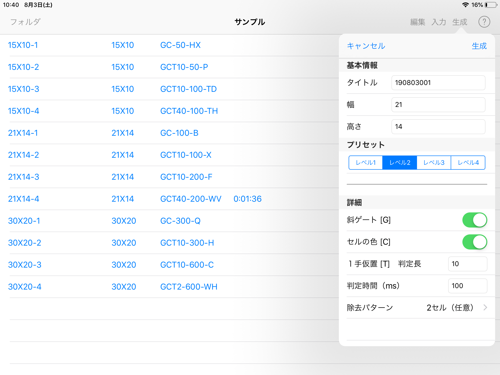
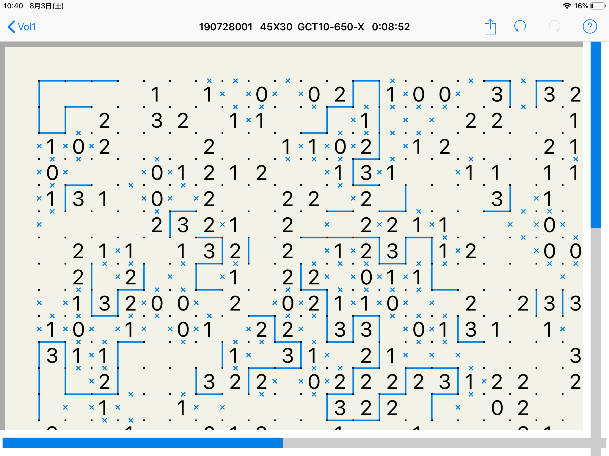

<a href="./index.html">TOPページ</a>

# 概要

### アプリケーションの特徴 

* 解き味を出来るだけ紙のパズルと同じになるようにしてあります。（線は点の間を指やペンでなぞることで入力します。複数の点を連続して結ぶことも可能です。）
* 問題の自動生成機能があり、初級から難問までの様々なレベルの問題を自由に作ることが可能です。
* 自分で1つ1つの数字を手で入力して新しい問題を入力することも出来ます。
* 各画面で簡単な操作ガイドを見ることができます。
* 動作環境は、iOS9.0以上、iPad専用です。

### スリザーとの相違点

Slither2 は、SLPlayer（ **スリザー** という名称でAppStoreで公開中）の後継という位置付けになりますが、様々な面で進化しています。
主な違いは以下のようなものになります。

* 問題の自動生成が可能になりました。（その代わりスリザーに同梱されていた大量の問題は今回はついていません）
* スリザーにあった、写真や画像からの問題の自動認識機能は省略されています。
* スリザーでは標準が拡大モードで、全体表示時には見ることしかできませんでしたが、スリザー2では標準が全体表示モードで、そのままパズルを解くことが可能です。これはApplePencilが殆どのiPad使えるようになったことにより、全体表示の状態でも問題なく操作が可能になったと考えたためです。
* スリザーでは1回に制限していたUNDOを無限に可能にしました。
* 操作には関係ありませんが、開発言語がObjective-CからSwiftに変わっています。

### 主な画面

#### パズル一覧

パズル一覧の各行に書かれている内容は、左から順に、名称、盤面のサイズ、メモ、解いた実績となります。各々の内容は以下の通りです。
- 名称：問題を生成する際に指定した名称、自動生成時の初期値は生成した年（西暦下2桁）月日＋3桁の連番
- サイズ：横のセル数 X 縦のセル数
- メモ：自動生成した場合、生成時のパラメータ（詳細は[パズルの生成](./generation.html)を参照）、ハイフン（-）で区切られた以下の3つの部分で構成
  - 先頭：利用した解法、Tの後ろの数字は1手仮置の判定長
  - 中央：判定時間
  - 末尾：除去パターン
- 実績：解くのにかかった時間、盤面を固定した回数、盤面を初期化した回数  

このうち、名称とメモは「名称変更」により変更することができます。

#### 問題生成

#### パズル実行

#### パズル実行（拡大表示）

<a href="./index.html">TOPページ</a>

