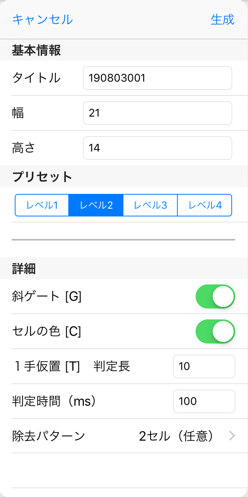

<a href="./index.html">TOPページ</a>

# パズルの生成

本ページでは、パズル生成の画面で指定可能な各種の条件が、実際にパズルを生成する際にどういう意味合いを持つのかを説明します。
使用されている用語に関しては[こちらのページ](./terms.html)を、解法に関しては[こちらのページ](./solver.html)参照してください。

## 生成の仕組み

各種の条件の意味合いを理解するには、まず、パズル生成の仕組みを知る必要があります。  
パズルの生成は大きく、以下の2つの段階に分けることができます。

### 1）ループの生成

まず、最終的な正解となるできるだけ長い一続きのループを生成します。  
基本的には、ランダムに選択されたノードから、ランダムな方向にONのエッジを伸ばしていき、できるだけ長く、且つ始点に戻ってこれるループが得られるまで試行錯誤します。  
もうそれ以上、ONエッジの先端を伸ばしていく余地がなくなり、始点まで戻ってもまだ長さが足りない場合には、出来上がったループの中で一番広い空き領域に接する部分のエッジを切断して、そこからその空き領域へ向けてONのエッジを伸ばしていきます。  
このようにして、盤面の大きさに対してある割合以上の長さのループが得られた段階でそれを正解のループとします。  
実際にはここで得られるループの形がパズルの難易度に大きく影響しますが、ループの形状をコントロールするのは難しいため、生成の条件とは無関係に同じ処理を行います。

### 2）数字の除去

正解のループが決まったあと、ひとまず盤面の全セルに数字を記入します。  
次に、生成条件の一つ、除去パターンに従って、盤面の数字を一定数ずつランダムな順番に除去して（空白にして）行きます。  
1組の数字を除去するたびに、そのパズルが論理的に解けるかどうかを判定して、制限時間内に解けた場合には除去したセルはそのまま空白とし、解けなかった場合には元の数字に戻します。  
これを全セル分繰り返して、残った数字が、生成されたパズルになります。  
生成条件の中で除去パターン以外のものは、パズルが解けるかどうかを判定する際に使用する解法と、その制限時間になります。  
より高度な解法を使用し、長い制限時間を適用することで、セルから数字が除去される率が上がり、結果的に難しいパズルが生成されます。ただし、高度な解法＋長い制限時間の方が必ず難しくなるわけでもなく、場合によっては簡単な解法だけで非常に難しいパズルができてしまうこともあります。

#### パズルの解き方

数字を除去するにあたって、パズルを解く際には、以下のルールに従います。

* 基本解法は、生成条件の指定にかかわらず常に実行されます。
* 斜ゲート、セルの色は、生成条件画面でオプションをONにした場合にのみ実行します。
* １手仮置は、生成条件画面で「判定長」に0より大きい数字を指定した場合にのみ実行します。その際に、仮置をしてから矛盾、またはON/OFFで同じ状態になるエッジが見つかるまでに他の解法を利用してループを延長する長さが、ここで指定した判定長を超えると探索を打ち切り、その仮置では確定しないとみなします。
* 領域出入は、処理時間が大きいため、パズルの自動生成時には利用しません。
* 生成条件画面で指定した制限時間を超えた場合、そのパズルは解けないものと判定します。

## 生成画面の指定内容

#### タイトル

タイトルは年（西暦2桁）月日＋連番3桁で自動的に振られますが、自由に変更することも可能です。

#### 幅、高さ

パズルの大きさを指定します。特に制限はありませんが、長辺が40程度が限界だと思います。

#### プリセット

1から4までのレベルを選択することで、詳細部分の項目を一括で設定します。
最初は、プリセットの状態でパズルを生成してみて、もう少し易しくとかもう少し難しく、という場合に詳細項目の設定を行うのがお薦めです。　
プリセットで設定される内容は、判定時間以外はパズルの大きさにかかわらず同じになります。（判定時間は盤面の大きさに比例して変化します）  
従って、プリセットのレベルは、同じ大きさのパズルの中での相対的な難易度であるとお考えください。
通常、問題の大きさが大きいほど難しい問題になります。

#### 斜ゲート[G]

基本解法で打ち手が見つからなかった場合に、斜めゲートを利用するかどうかを指定します。

#### セルの色[C]

基本解法と斜めゲートで打ち手が見つからなかった場合に、セルの色を利用するかどうかを指定します。

#### １手仮置[T]　判定長

基本解法と斜めゲート、セルの色で打ち手が見つからなかった場合に、１手仮置きを利用するかどうか、する場合に矛盾または状態の一致するエッジが見つかるまでに何本のエッジまでループを伸ばしてよいかを指定します。

*   0: １手仮置きを利用しません。
*   1以上: １手仮置きを利用します。その際に、仮置きをしたあと矛盾または状態の一致するエッジが見つかって確定するまでに他の解法を利用してループを延長する最大長さを指定した値に制限します。

#### 判定時間

パズルを各種の解法を駆使して解いていく際に、ここで指定する時間以上かかっても解けない場合には、そのパズルは（実際には時間をかければ解ける問題であっても）解けないと判定します。  
指定する数字は、iPad Air 2（2014年製）で処理する場合の最大処理時間（ミリ秒）になります。
例えば、ここで100と指定した場合、一組の数字を除去してそのパズルが解けるかを試みて、iPad Air 2 であれば100ミリ秒以内に正解が求められなければ、解けないと判断することになります。  
iPad Air 第3世代（2019年製）では、処理時間は iPad Air 2 の概ね1/5になりますので、ここで100と指定した場合のパズルを解く許容時間は20ミリ秒程度になります。
（使用しているiPadの処理性能は、アプリ起動時に基準のパズルを解いてその処理時間から推定しています）

#### 除去パターン

盤面から数字を間引いていくパターンを選択します。  
パターンは以下の4つのグループに分類できます。
「（グループ名）任意」という名称のパターンの場合には、そのグループに属する実際のパターンの中のどれかがランダムに選択されます。

*   4セル：一度に4つのセルの数字を同時に除去するパターンで、4つのセルの選択の仕方が異なるいくつかのパターンが存在します。
*   2セル：一度に2つのセルの数字を同時に除去するパターンで、2つのセルの選択の仕方が異なるいくつかのパターンが存在します。
*   1セル：一度に1つのセルの数字を除去するパターンです。除去する順番を、早めのものと遅めのものに2分し、まず早めのグループの中からランダムな順番で除去していき、それが済んだら遅めのグループから除去していきます。早めのグループの定義の仕方によりいくつかのパターンが存在します。
*   1セル（難問）：仕組みは1セルと同じですが、早めのグループの定義方法により、比較的難しいパズルができる傾向にあるパターンが選ばれています。

<a href="./index.html">TOPページ</a>

