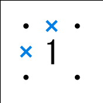

<a href="./index.html">TOPページ</a>

# 付録A　初期探索パターン

#### コーナー

|パターン|説明|
|:----:|:---|
||コーナーに１がある場合、その外側のエッジはOFF|
||コーナーに３がある場合、その外側のエッジはON|
||コーナーに２がある場合、コーナーの隣のノードから２と逆側に伸びるエッジはON|
||コーナーに２があり、その隣に３がある場合、コーナーの隣のノードから２と逆側に伸びるエッジはON、３の２と逆側のエッジもON|

#### 辺

|パターン|説明|
|:----:|:---|
||外周に沿って１が並ぶ場合、その間のエッジはOFF|
||外周に沿って１と３が並ぶ場合、3との外周に接するエッジはON、１の３と逆側のエッジとその隣のエッジはOFF|

#### 数字の並び

|パターン|説明|
|:----:|:---|
||０の周囲の4本のエッジはOFF|
||３が横に並んだ場合、3本の縦のエッジがON、中央のONエッジの両延長エッジがOFF|
||３が横に並んでその上(下)に２がある場合、上のパターンに加えて、２の３と逆側のエッジはON、３の外側の２に接続する縦線の２と逆側のエッジがOFF|
||３が斜めに並んだ場合、お互いの外側の2本の縦のエッジがON|
||３が間がすべて２で埋まった状態で斜めに並んだ場合も、上と同様にお互いの外側の2本の縦のエッジがON|

<a href="./index.html">TOPページ</a>

