

<a href="./index.html">TOPページ</a>

# 付録E　除去パターン

#### ４セル

一度に４つのセルの数字を除去していくパターンです。

|パターン名|パターン|説明|
|:------:|:----:|:---|
|４セル（任意）||以下の４セルのパターンのいずれか|
|ＸＹ対象 [XY]|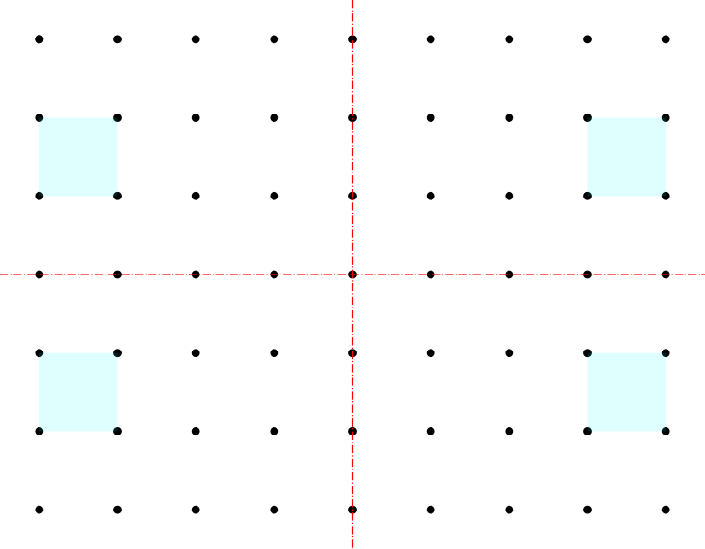|左上1/4の領域から任意のセルを選択し、そのセルの上下対象位置のセル、それらのセルの左右対称位置のセルの４つを同時に除去|
|横２連Ｘ対象 [HX]|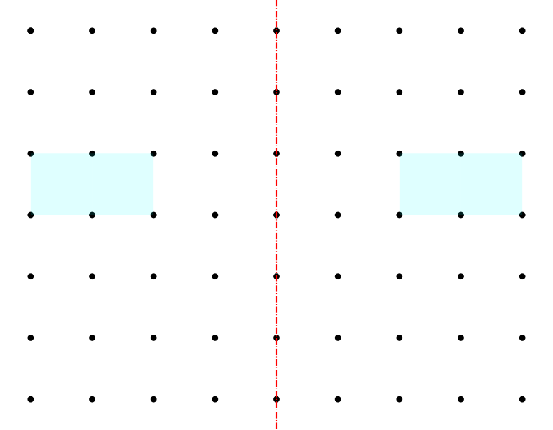|左半分の領域から横に2つ並んだ任意のセルを選択し、その左右対称位置をあわせた４つのセルを同時に除去|
|斜２連Ｘ対象 [DX]|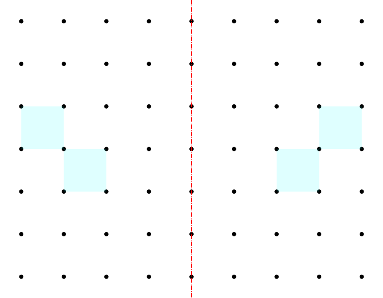|左半分の領域から斜に2つ並んだ任意のセルを選択し、その左右対称位置をあわせた４つのセルを同時に除去|
|田型４連 [Q]|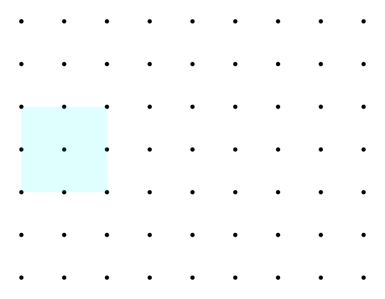|田型に４つ並んだ任意のセルを選択し同時に除去|

#### ２セル

一度に２つのセルの数字を除去していくパターンです。

|パターン名|パターン|説明|
|:------:|:----:|:---|
|２セル（任意）||以下の２セルのパターンのいずれか|
|Ｘ対象 [X]|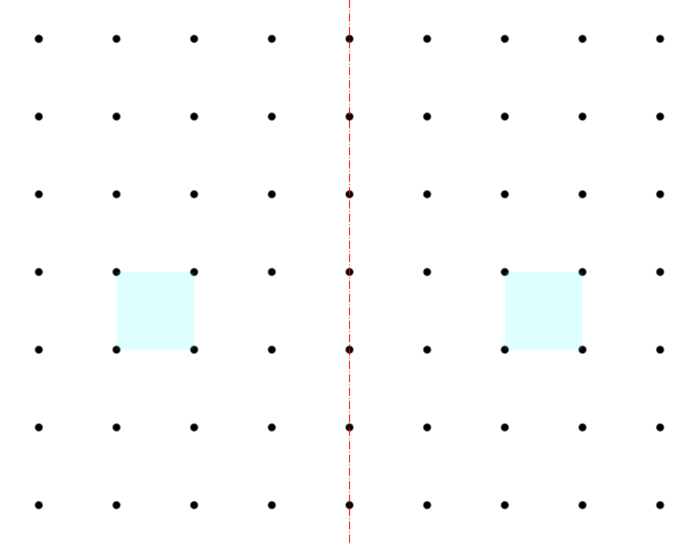|左半分の領域から任意のセルを選択し、そのセルの左右対称位置をあわせた２つのセルを同時に除去|
|Ｙ対象 [Y]|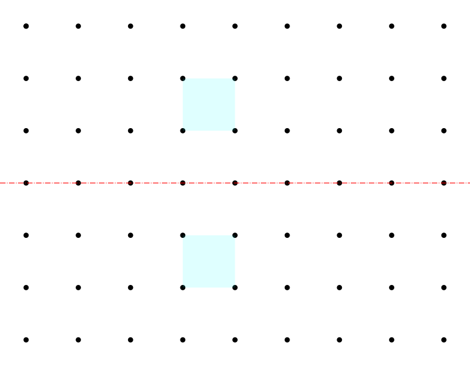|上半分の領域から任意のセルを選択し、そのセルの上下対象位置をあわせた２つのセルを同時に除去|
|点対象 [P]|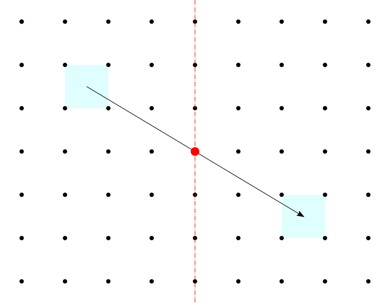|左半分の領域から任意のセルを選択し、そのセルの中心点対象位置をあわせた２つのセルを同時に除去|
|横２連 [H]|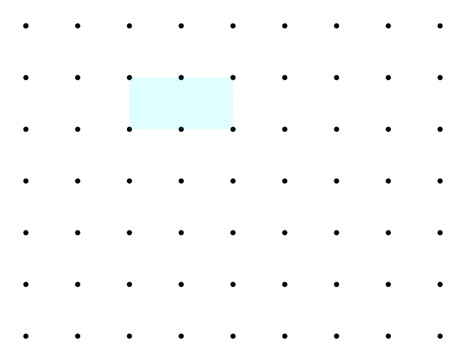|横に2つ並んだ任意のセルを選択し同時に除去|
|斜２連 [D]||斜に2つ並んだ任意のセルを選択し同時に除去|

#### １セル

一度に１つのセルの数字を除去するパターンです。  
「XX優先」という名称のパターンは、盤面を何らかのパターンで２分し、まず片方の（以下の表で色がついた側の）セルの中から任意の順番で除去、次に残りのセルの中から除去していきます。

|パターン名|パターン|説明|
|:------:|:----:|:---|
|１セル（任意）||以下の１セルのパターンのいずれか|
|制約なし [F]|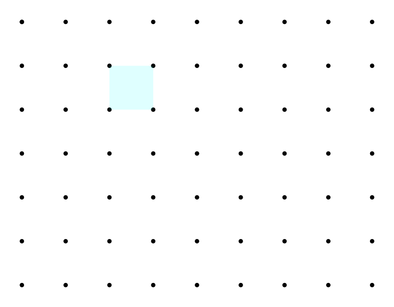|任意のセルを選択し除去|
|太斜縞優先 [WD]|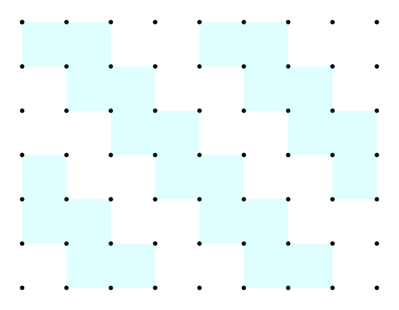|盤面を太い斜めの縞状に２分する優先パターン|
|細斜縞優先 [TD]|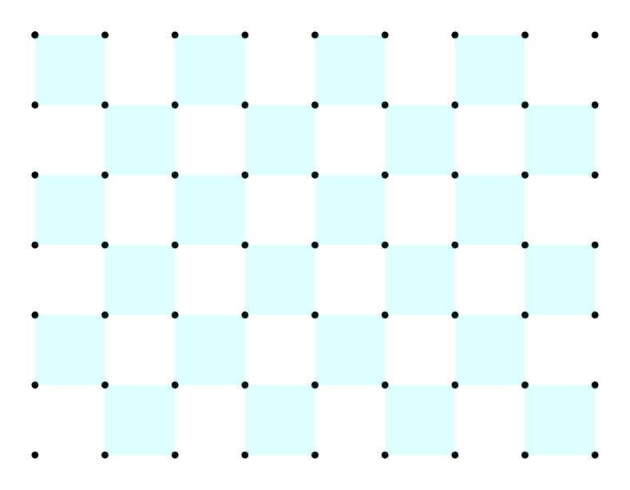|盤面を細い斜めの縞状に２分する優先パターン|
|チェック優先 [C]|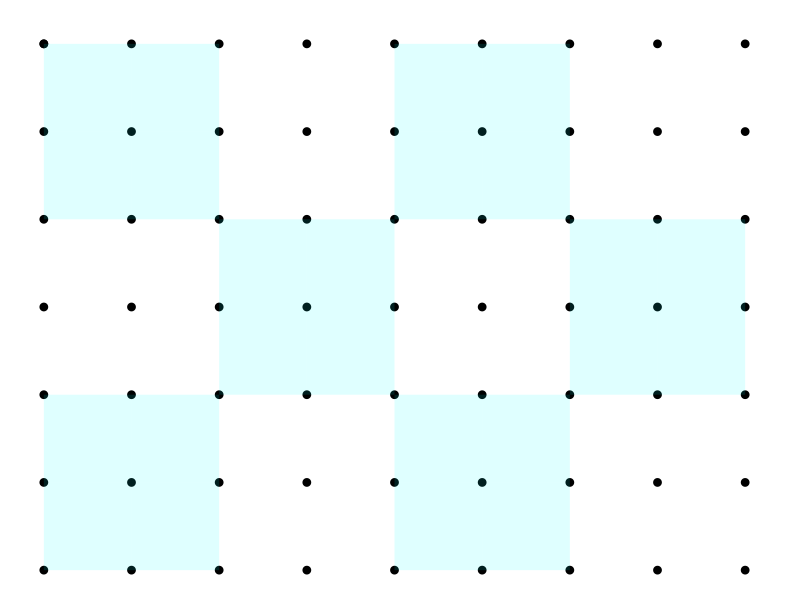|盤面を田型の４つのセルからなる市松模様に２分する優先パターン|

#### １セル（難問）

「１セル」の１種ですが、難しめの問題ができる傾向にある優先パターンです。

|パターン名|パターン|説明|
|:------:|:----:|:---|
|難問（任意）||以下の難問のパターンのいずれか|
|太縦縞優先 [WV]|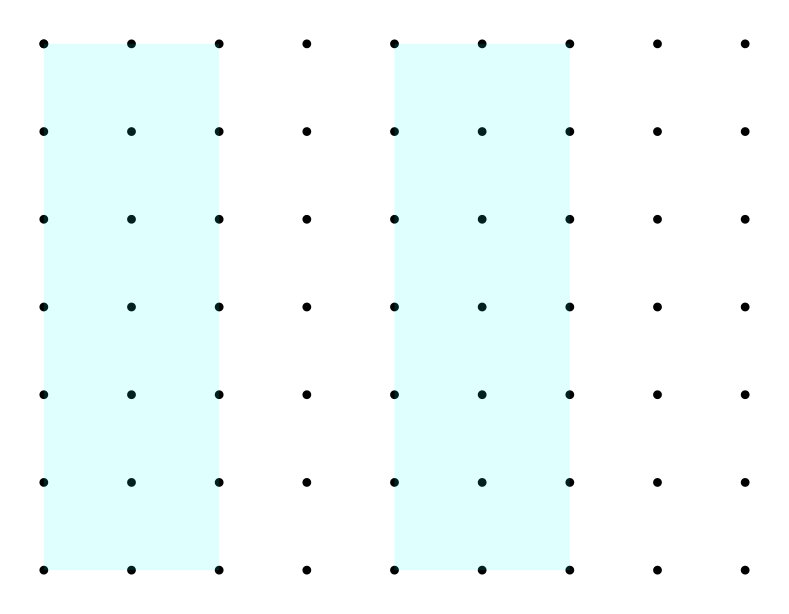|盤面を太い縦縞状に２分する優先パターン|
|細縦縞優先 [TV]|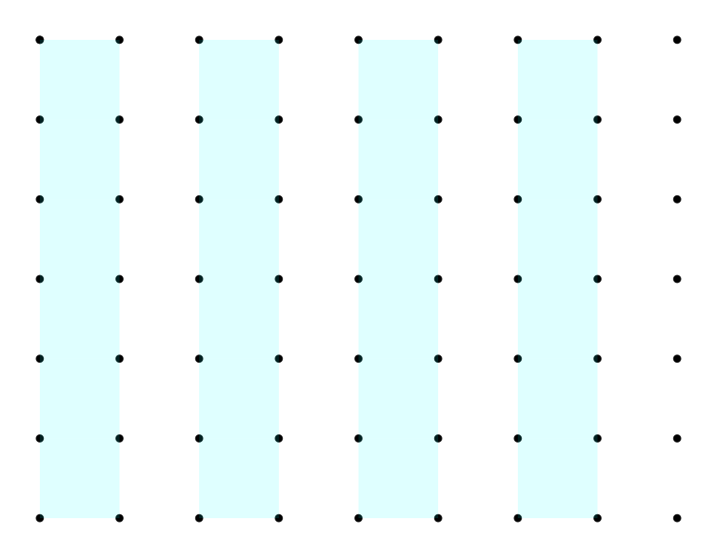|盤面を細い縦縞状に２分する優先パターン|
|太横縞優先 [WH]|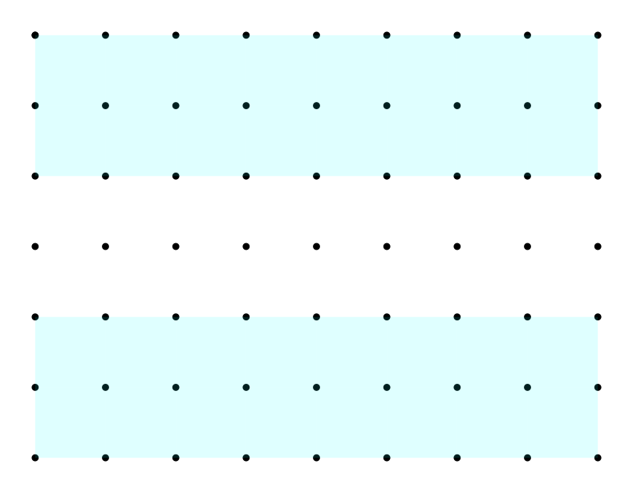|盤面を太い横縞状に２分する優先パターン|
|細横縞優先 [TH]|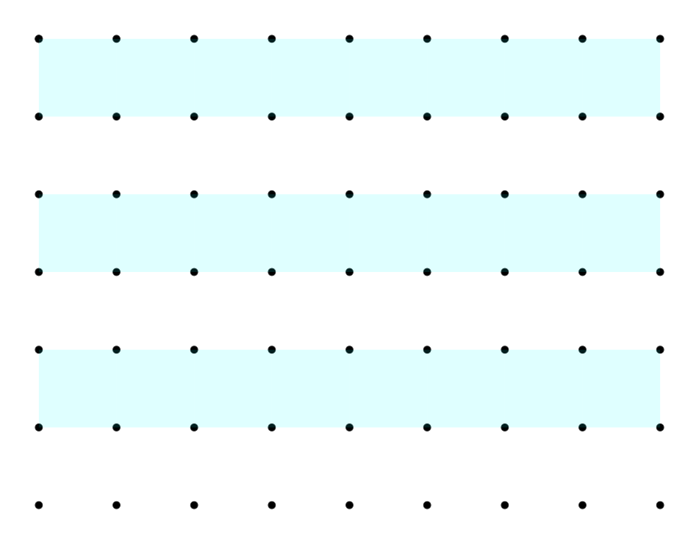|盤面を細い横縞状に２分する優先パターン|

<a href="./index.html">TOPページ</a>

